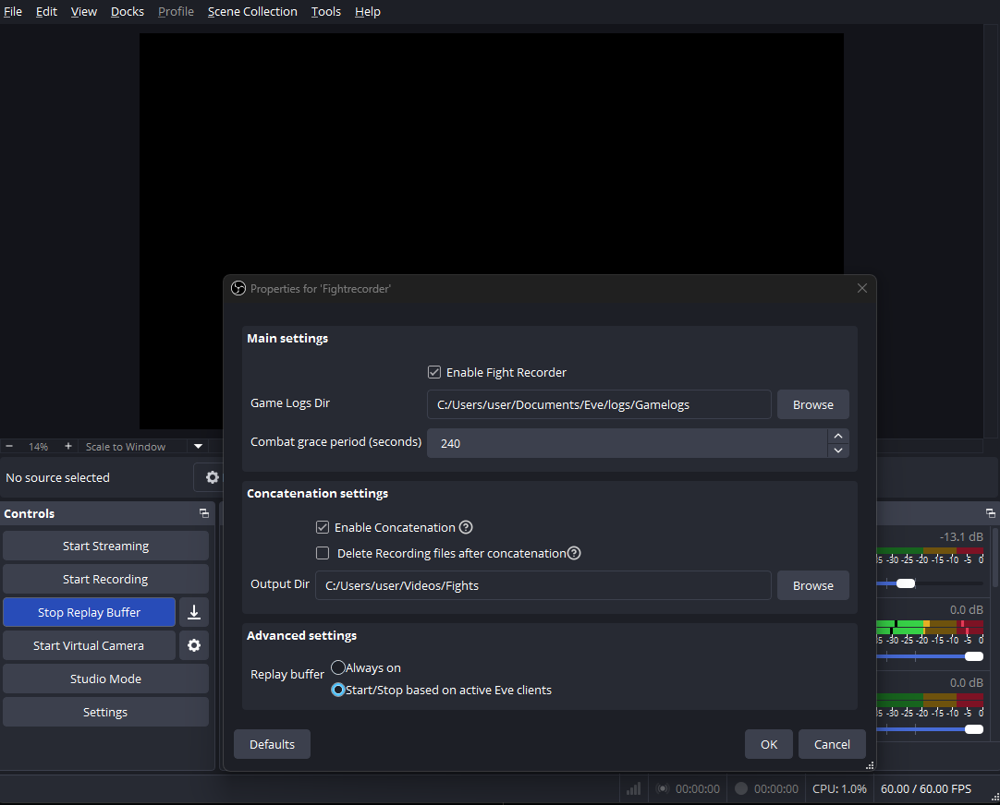

# obs-fightrecorder

## Introduction
An OBS plugin for the game Eve Online. The plugin detects if you are in combat and records your gameplay.

    

## Installation
- Before installing the plugin, make sure to enable the replay buffer functionality in Settings -> Output -> Replay buffer. 
- Download the zip file from the latest release
- Unzip the file and place the `obs-plugins/64bit/obs-fightrecorder.dll` file in the OBS plugins folder, which is `C:\Program Files\obs-studio\obs-plugins\64bit` by default.

## Build
To build this project please follow the steps [here](https://github.com/obsproject/obs-plugintemplate/wiki/Quick-Start-Guide#windows) for Windows. You need Visual Studio 2022.

## FAQ
Is this only available on Windows?
> Yes.

Which files are observed?
> The files in the "Gamelogs" directory where something was logged within the last 24 hours. Per default the directory is located in `C:\Users\<user>\Documents\EVE\logs\Gamelogs`

How do you detect combat?
> I detect combat if I see either "combat" or "has applied bonuses to" in the log files.

How do I set up the replay buffer?
> obs-fightrecorder uses the Replay buffer you have configured in OBS. (Settings -> Output -> Replay buffer).

Where are the replays stored?
> The replay buffer and recording are both saved in the directory you have configured in OBS (Settings -> Output -> Recording path).

What is the grace period?
> The number of seconds the plugin will record after the last combat trigger has been seen in the log file. Every time something combat-related happens in the log file the timer gets refreshed. The default value is 120s. 

Can I concatenate (merge) the files after the combat is over?
> Yes. However I cannot guarantee it works with all recording formats and video encodings. The final output file is also placed in your Recording directory (Settings -> Output -> Recording). The files automatically get the prefix "Fight". For example "Fight 2025-07-26 16-19-37.mkv".

How does the plugin see if my Eve clients are running?
> If the option "Replay buffer -> Start stop based on active Eve clients" is active I check (every 30 seconds) if there is a [windows title](https://learn.microsoft.com/en-us/windows/win32/api/winuser/nf-winuser-getwindowtexta) that includes "Eve - ". If I find one the the replay buffer gets started. If I don't find any for 5 minutes the OBS replay buffer gets stopped again.
